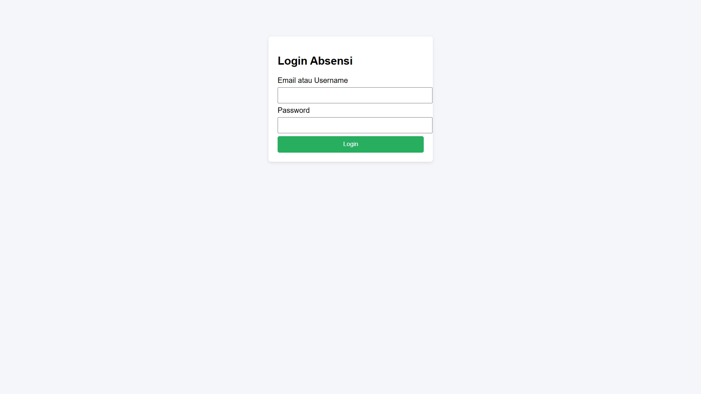
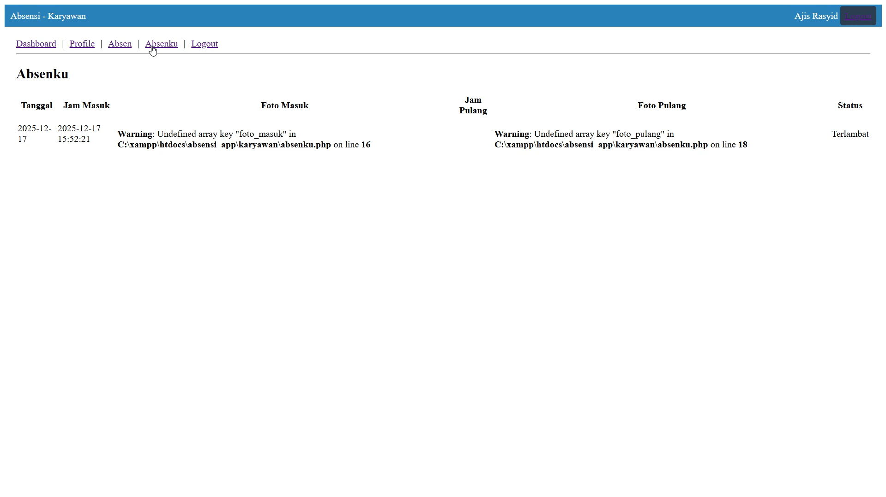
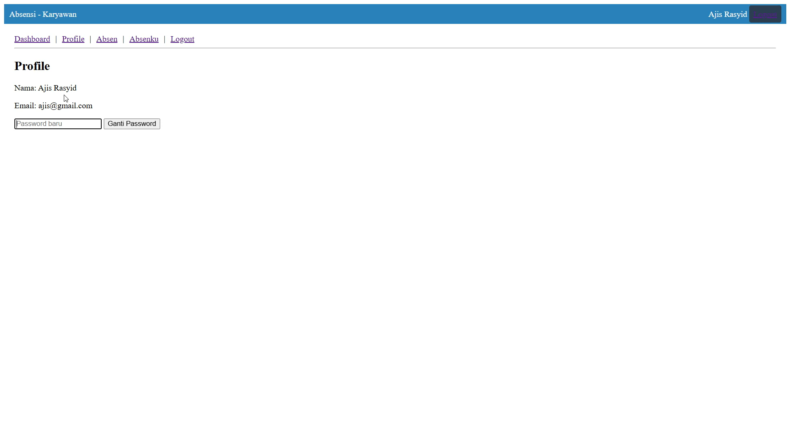
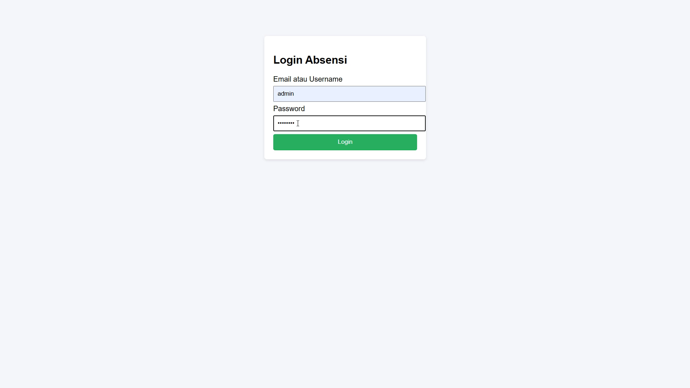
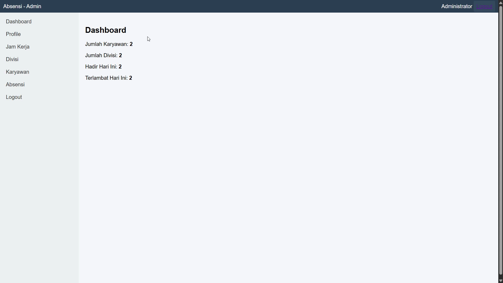
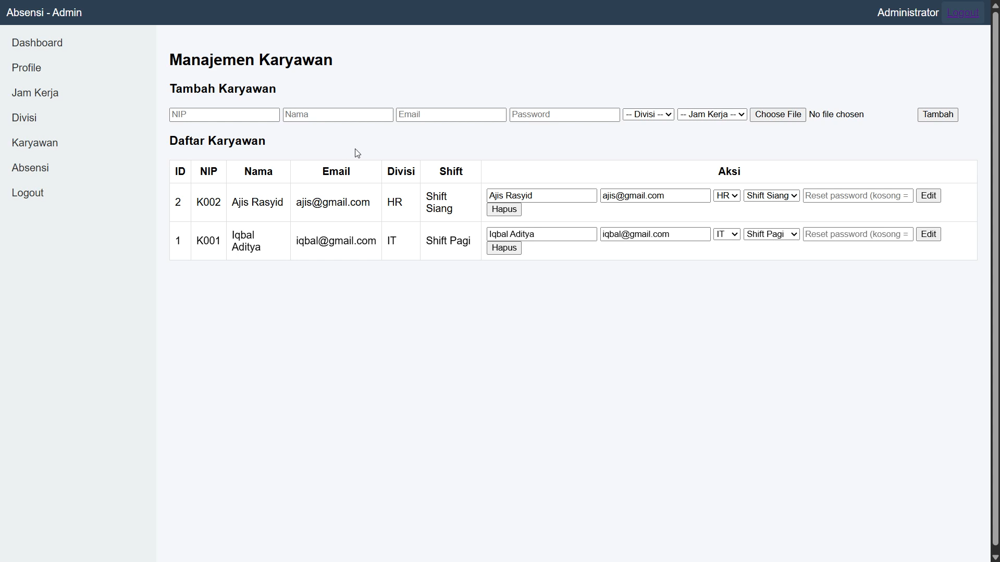
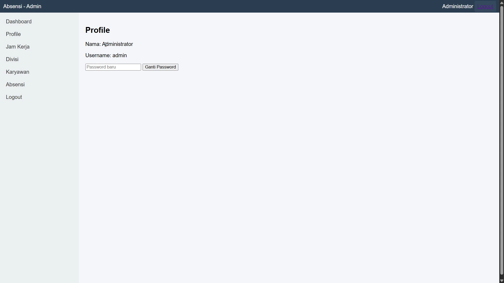
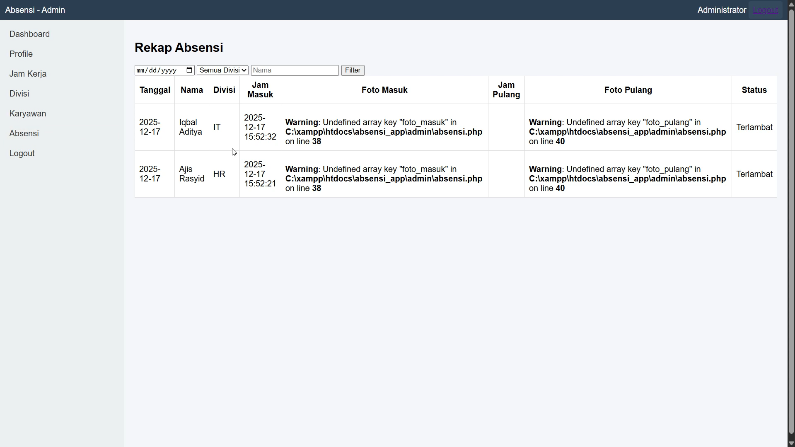

# 📌 Sistem Absensi Karyawan (PHP Native)

Aplikasi absensi karyawan berbasis web menggunakan PHP Native dan MySQL.  
Project ini dibuat untuk memenuhi tugas mata kuliah **Pemrograman Web 2**.

---

## 🚀 Fitur Aplikasi
- Login Admin & Karyawan
- Profile Admin & Karyawan
- Dashboard Karyawan & Admin
- Halaman Manajemen Divisi, Manajemen Karyawan, Manajemen Jam Kerja dan Rekap Absensi
- Absensi Masuk & Keluar
- Riwayat Absen 

---

## 🖼️ Tampilan Aplikasi

### 🔐 Halaman Login Karyawan

### 📊 Dashboard Karyawan

### 🕒 Halaman Absensi

### 🕒 Halaman Absensku

### 🕒 Halaman Profile Karyawan

### 🔐 Halaman Login Admin

### 📊 Dashboard Karyawan

### 📊 Halaman Manajemen Divisi

### 📊 Halaman Manajemen Jam Kerja 

### 📊 Halaman Manajemen Karyawan 

### 📊 Halaman Profile Admin

### 📊 Halaman Rekap Absen 

---

# 📌 Halaman login karyawan

Pada tampilan ini, pengguna diminta untuk login ke sistem absensi menggunakan email atau username serta password.
Halaman login berfungsi sebagai keamanan awal agar hanya pengguna yang terdaftar yang dapat mengakses aplikasi absensi. Setelah data dimasukkan dengan benar dan tombol Login ditekan, pengguna akan diarahkan ke halaman dashboard.

# 📌 Halaman dashboard karyawan 

Halaman dashboard menampilkan informasi utama pengguna setelah berhasil login.
Di halaman ini terdapat:
-	Ucapan selamat datang sesuai dengan nama karyawan
-	Informasi jadwal kerja (contoh: Shift Siang 09.00–17.00)
-	Status kehadiran hari ini, apakah sudah melakukan absensi masuk atau belum
Dashboard berfungsi sebagai ringkasan kondisi absensi pengguna pada hari tersebut.

# 📌 Halaman absen

Halaman absen digunakan untuk melakukan absensi masuk (clock in) dan keluar (clock out).
Pada halaman ini:
-	Sistem meminta izin kamera dan lokasi
-	Kamera digunakan untuk mengambil foto wajah karyawan sebagai bukti kehadiran
-	Terdapat tombol Clock In / Clock Out untuk mencatat waktu kehadiran

# 📌 Halaman absenku

Halaman ini menampilkan riwayat absensi karyawan, yang berisi:
-	Tanggal absensi
-	Jam masuk
-	Foto saat masuk
-	Jam pulang
-	Foto saat pulang
-	Status kehadiran (contoh: Terlambat)
Halaman ini berfungsi sebagai laporan pribadi karyawan untuk melihat kehadiran yang sudah dilakukan sebelumnya.

# 📌 Halaman profile karyawan

Pada halaman profile, sistem menampilkan data pribadi karyawan, seperti:
-	Nama
-	Email
Selain itu, tersedia fitur ubah password, sehingga pengguna dapat mengganti password lama dengan yang baru untuk menjaga keamanan akun.

# 📌Halaman login admin

Halaman ini digunakan oleh admin untuk masuk ke dalam sistem absensi.
Admin melakukan login menggunakan username dan password. Setelah proses autentikasi berhasil, admin akan diarahkan ke halaman dashboard admin untuk mengelola data absensi.

# 📌 Halaman dashboard admin

Halaman dashboard admin menampilkan ringkasan informasi penting dalam sistem absensi, yaitu:
-	Jumlah karyawan yang terdaftar
-	Jumlah divisi
-	Jumlah karyawan yang hadir hari ini
-	Jumlah karyawan yang terlambat hari ini
Dashboard ini berfungsi sebagai monitoring cepat bagi admin untuk mengetahui kondisi kehadiran karyawan secara keseluruhan.

# 📌 Halaman manajemen divisi

Pada halaman ini, admin dapat mengelola data divisi perusahaan.
Fungsi yang tersedia:
-	Menambahkan divisi baru
-	Mengedit nama divisi
-	Menghapus divisi
Data divisi digunakan untuk pengelompokan karyawan dalam sistem absensi.

# 📌 Halaman manajemen jam kerja

Halaman ini digunakan untuk mengelola jam kerja atau shift karyawan.
Admin dapat:
-	Menambahkan jam kerja baru (nama shift, jam masuk, jam pulang, dan toleransi keterlambatan)
-	Mengedit jam kerja yang sudah ada
-	Menghapus jam kerja
Fitur ini penting untuk menentukan aturan waktu absensi yang digunakan oleh karyawan.

# 📌 Halaman manajemen karywan 

Halaman ini digunakan untuk mengelola data karyawan.
Admin dapat:
-	Menambahkan karyawan baru (NIP, nama, email, password, divisi, dan jam kerja)
-	Melihat daftar seluruh karyawan
-	Mengedit data karyawan
-	Menghapus data karyawan
-	Mengatur ulang (reset) password karyawan
Halaman ini berfungsi sebagai pusat pengelolaan data karyawan dalam sistem.

# 📌 Halaman profile admin

Pada halaman profile admin, sistem menampilkan data akun admin, seperti:
-	Nama admin
-	Username
Admin juga dapat melakukan perubahan password untuk menjaga keamanan akun sistem.

# 📌 Halaman rekap absen

Halaman rekap absensi menampilkan laporan kehadiran seluruh karyawan.
Informasi yang ditampilkan meliputi:
-	Tanggal absensi
-	Nama karyawan
-	Divisi
-	Jam masuk
-	Foto masuk
-	Jam pulang
-	Foto pulang
-	Status kehadiran (tepat waktu atau terlambat)
Admin juga dapat melakukan filter data berdasarkan tanggal, divisi, atau nama karyawan.
Halaman ini digunakan sebagai laporan dan evaluasi kehadiran karyawan.

---

## 🛠️ Teknologi yang Digunakan
- PHP Native
- MySQL
- Bootstrap
- XAMPP

---

## ⚙️ Cara Menjalankan Project
1. Clone repository ini
2. Pindahkan folder ke `htdocs`
3. Import database `sql/absensi_app.sql`
4. Jalankan melalui browser
